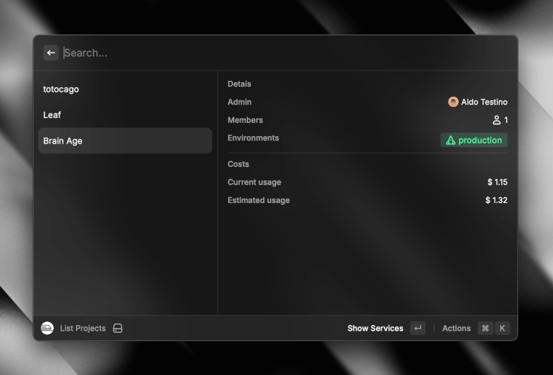

# 🚂 Railway Raycast Extension

A powerful Raycast extension for managing Railway projects with ease. View projects, monitor services, and track deployments right from your Raycast interface!



## ✨ Features

- **Project Management**  
  - List and search for Railway projects.  
  - View environments, team members, and estimated costs.

- **Service Insights**  
  - List services for each project.  
  - Monitor service status in real time.

- **Deployment Tracking**  
  - View deployments for each service.  
  - Access detailed build and deployment logs.

## 🚀 Commands

- **List Projects**: Quickly view and search all your Railway projects.


## ⚙️ Setup Instructions

Follow these steps to get started with the Railway Raycast Extension:

1. **Generate an API Token**  
   - Visit the [Railway API Tokens page](https://railway.app/account/tokens).  
   - Create a new API token for the extension.

2. **Clone the Repository**  
   ```bash
   git clone <repository-url>
   cd <repository-directory>
   ```

3. **Start the Extension**  
   Run the development server:  
   ```bash
   pnpm dev
   ```

4. **Authenticate**  
   - When prompted, enter your Railway API token.

5. **You're Ready to Go!** 🎉

## 🔗 Useful Links

- [Raycast](https://www.raycast.com/)  
- [Railway](https://railway.app/)  